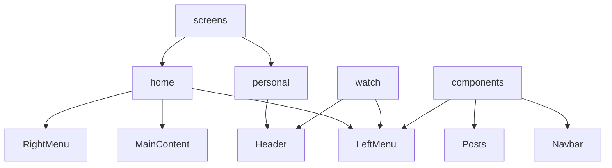

> 1. Lazy load
> 1. Image upload (firebase)
> 1. Fix type (Component.types.ts)
> 1. Fix icon
> 1. Animation dropdown Menu

> bug:
>
> - when switch user, personal page has cache
> - when zoom and scroll --> not fetch more data
